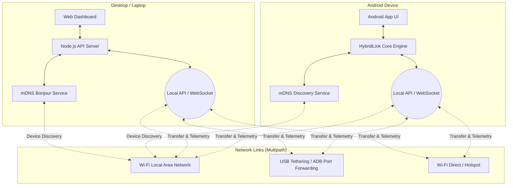

# HybridFileShare Architecture

HybridFileShare is a multi-platform file transfer system that utilizes a combination of Wi-Fi, Hotspot, and USB IP (ADB/RNDIS) channels simultaneously to achieve maximum transfer speeds. 

The system consists of three main components:
1. **Android Application (Mobile Node):** The primary peer acting as the sender or receiver. 
2. **Dashboard (Web Hub / Node.js API):** A local command center and visual interface for desktop pairing and monitoring.
3. **Windows Client (PC Node):** An optional native client built with Tauri or Python for deep desktop integration.

## How It Works

### 1. Discovery Phase
- All devices broadcast their presence on the local network using **mDNS** via the `_hybridfileshare._tcp` protocol.
- The **Android App** uses `NsdManager` to resolve services.
- The **Node.js Server** uses `bonjour-service` to scan for and broadcast metadata (such as device name, platform, unique ID, and version).
- Secondary discovery methods include **QR Code scanning** (encoding an IP direct link) and **PIN code** exchange for devices that cannot resolve mDNS.

### 2. Connection & Handshake
- When a device is selected, the requesting node initiates a WebSocket handshake with the target node's API.
- The handshake exchanges capabilities, session keys, and active network interfaces.
- If accepted via the Dashboard or App UI, a secured multipath session is established.

### 3. Multipath File Transfer
- The file is chunked into optimal sizes.
- The engine dispatches chunks concurrently across all active network interfaces (Wi-Fi `wlan0`, USB Tethering `rndis0`, Wi-Fi Direct `p2p0`, and Localhost `lo` via ADB). 
- The receiving node collects the chunks and reassembles them in order.

### 4. Telemetry & Dashboard
- The transfer engine constantly broadcasts real-time telemetry data over a WebSocket connection (port 9002).
- The Web Dashboard receives this telemetry and dynamically updates the UI, displaying individual channel speeds, total throughput, and active chunk transfers.
