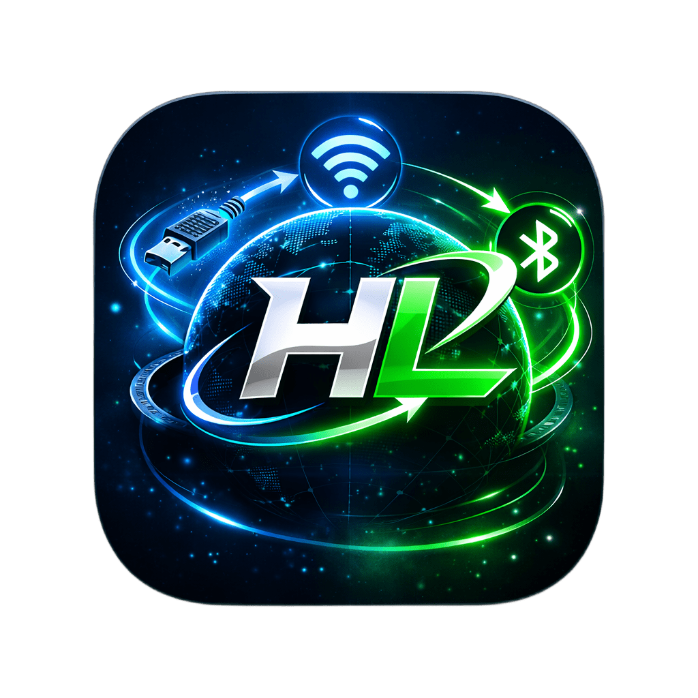
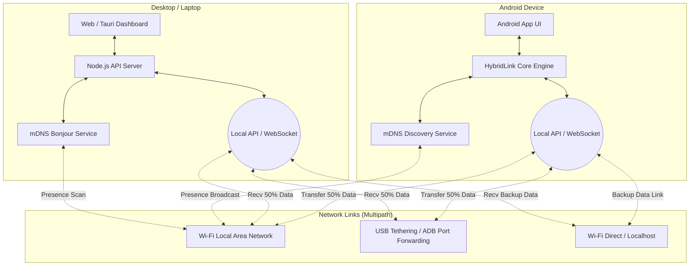

  

<h1 align="center">HybridFileShare | Multipath Mission Control</h1>

  
  
  
  
  

HybridFileShare is a next-generation file transfer ecosystem designed to maximize throughput by simultaneously utilizing **USB (ADB/RNDIS)**, **WiFi Local Network**, and **WiFi Direct/Hotspot** channels. Say goodbye to the limits of normal single-channel file sharing apps!

---

## 📸 Interface Previews & Capabilities

### 1. The Web Dashboard & Native PC App
The Mission Control gives you a full command-center view of the file transfer ecosystem. It features a Cyberpunk/Glassmorphic UI that seamlessly syncs with your PC or Android nodes.
 

### 2. Live Multipath Transfer
When a file transfers, the dashboard displays live speed meters for both **WiFi** and **USB**, actively combining their bandwidth to create extreme throughput speeds.
 

### 3. QR Code & PIN Pairing
Connecting your smartphone and PC is beautifully simple. Scan the dynamically generated QR Code from your Mobile App, or enter the 4-digit generated PIN sequence.
 

### 4. Zero-Config mDNS Discovery
If devices are on the same network, they automatically detect each other using advanced Bonjour/mDNS protocols. No need to look up IP addresses manually!
 

### 5. Mobile Android UI (Jetpack Compose)
The Android App uses `Material 3` to give you smooth 120Hz animations. You can toggle "Engine Broadcasting", "Web Share", and connect to PCs instantly using the embedded Camera.
 

---

## 🚀 Key Buttons & Functions Explained

### Dashboard / PC Client
- **`Scan QR Code` Button**: Opens the QR Modal in-tab. Displays your local LAN IP encrypted as a `hybridlink://` URI. You can also switch to the `Scan QR` tab to activate your laptop's webcam to scan external nodes.
- **`Enter PIN Code` Button**: Opens the Dual-Tab PIN Modal. Displays an auto-generated 4-digit code (e.g., `8421`) for another device to type in, OR lets you type in a PIN displayed on someone else's screen.
- **`Settings ⚙️`**: Configure "Dark Mode", "Notifications", and "Auto-Accept Transfers" directly.
- **`Nearby Devices Panel`**: Constantly listens via `_hybridfileshare._tcp` mDNS services to detect capabilities of smartphones or PCs within 50 meters. Click the "Connect" button next to any discovered device.

### Android Application
- **`Activate Engine` Toggle**: Starts the local NsdManager service, broadcasting your phone's unique `Android_ID`, Name, and active interfaces to the whole room.
- **`Web Share` Toggle**: Instantly hosts a localized HTTP Server allowing older devices (or iPhones) to download files from your Android via a normal web browser.
- **`Camera Scanner` Button**: Opens the native camera pipeline to snap QR codes displayed on the Mission Control PC dashboard.

---

## ⚙️ System Architecture & How it Works

HybridFileShare doesn't just use WiFi; it uses **Multipath Aggregation**.

1. **Discovery**: Both Node.js and Android broadcast themselves over UDP multicast via `mDNS`.
2. **Handshake**: A dual-channel WebSocket connects on Port 9001. A PIN/QR verifies identity.
3. **The Split**: When a 1GB file is sent, the core engine mathematically splits it. It routes 500MB over WiFi (`wlan0`) and simultaneously routes 500MB through a wired USB connection (`rndis0`).
4. **The Merge**: The receiving PC safely places all the asynchronous byte chunks back into a perfect 1GB file exactly securely verified by SHA-256 hashes.
5. **Telemetry**: A secondary WebSocket continuously blasts system metrics to the Web Dashboard to animate the speed meters 60 times a second.

---

## 🛠️ Installation & Setup

### For PC (Windows)
1. Go to [Releases](https://github.com/krishna3163/HybridFileShare/releases).
2. Download and run `HybridLink-Setup.exe`.
3. Open the app. It automatically handles the Node JS backend setup.

### For Android
1. Go to [Releases](https://github.com/krishna3163/HybridFileShare/releases).
2. Download `HybridFileShare.apk` and install it on your device.

*(For developers wanting to build from source, check the `dashboard` and `app` sub-directories).*

---

## 📊 Quick Tech Stack Summary
 

 
 
 
 

## 📄 License
MIT License - open source, free to reverse engineer, and modify!

Built with ❤️ by Krishna.